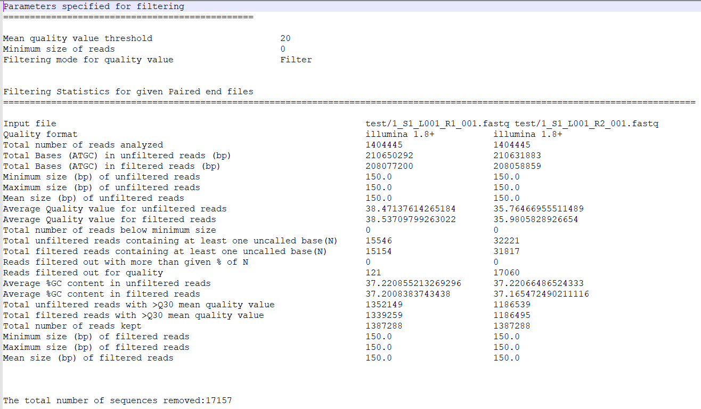
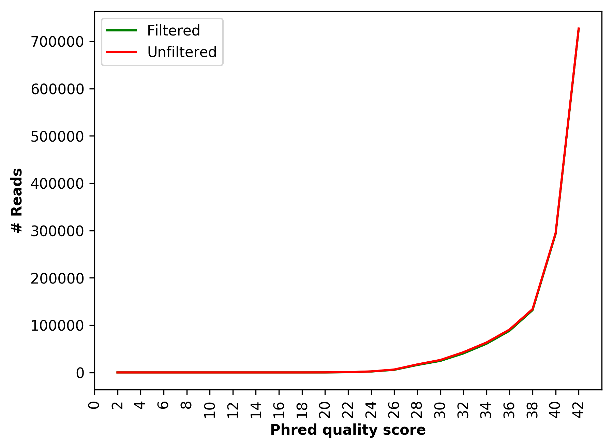
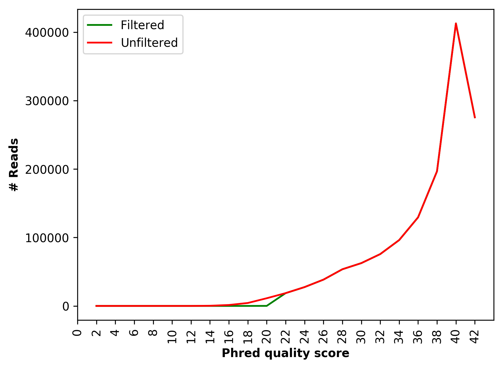
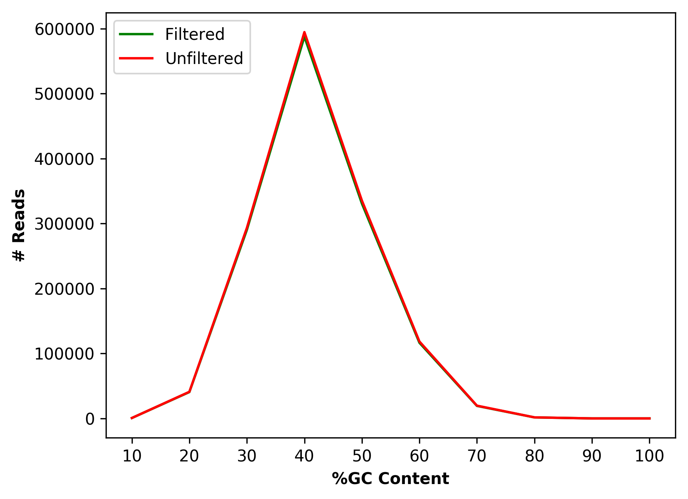
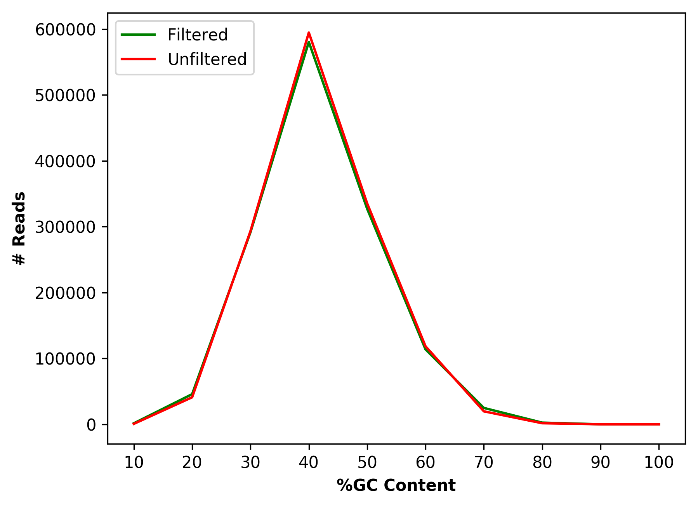
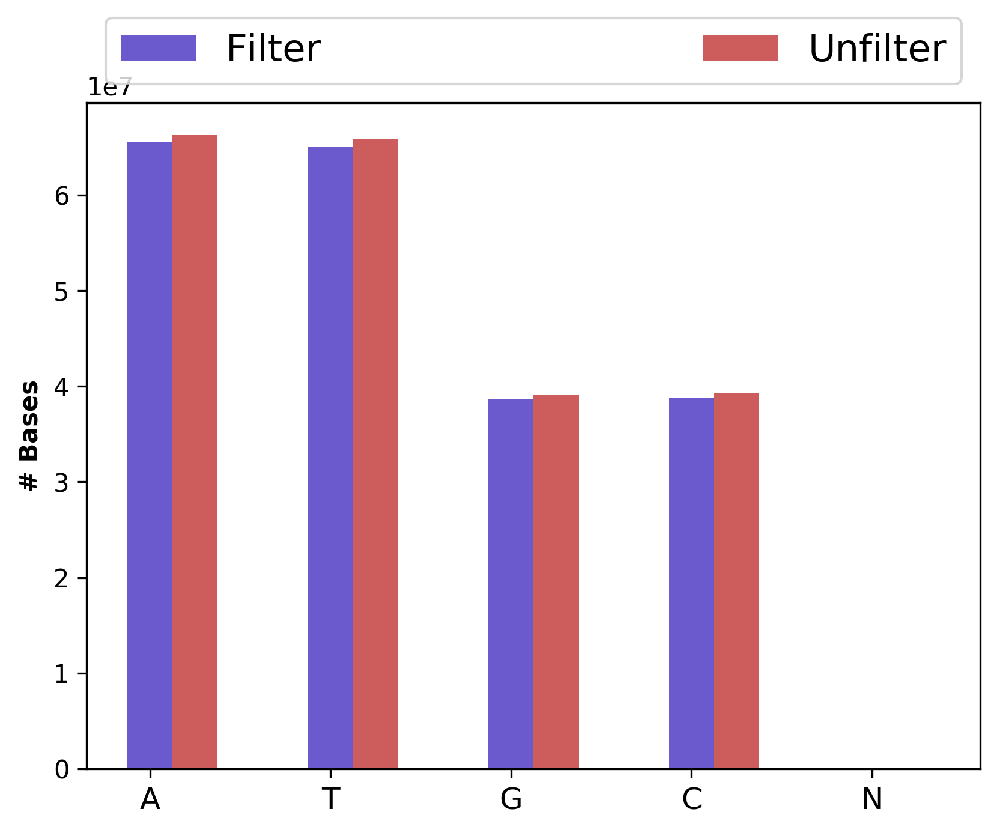
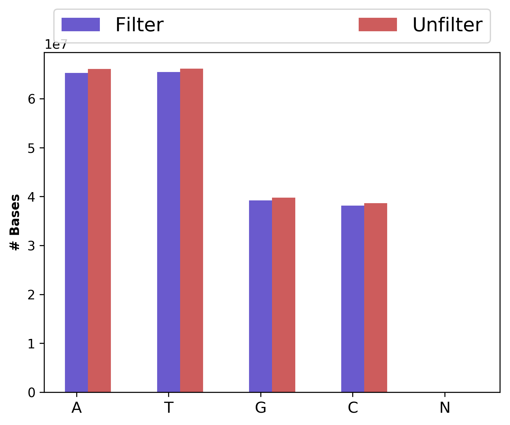
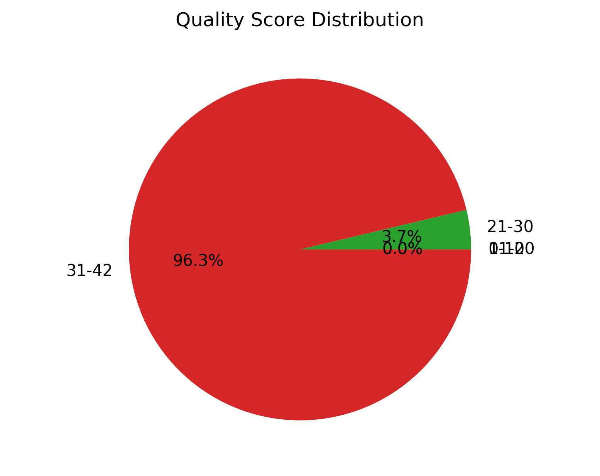
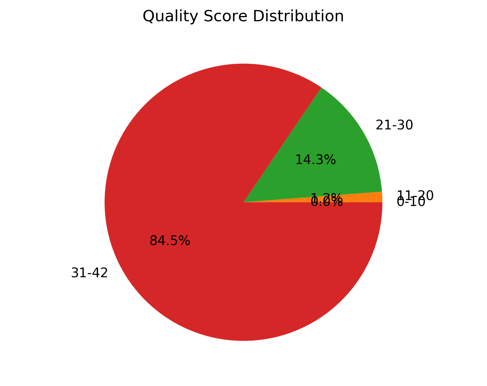

.. include:: cyverse_rst_defined_substitutions.txt

|CyVerse_logo|_

|Home_Icon|_
`Learning Center Home <http://learning.cyverse.org/>`_

**HTSeqQC Quick Start**
========================

..
    #### Comment: Use short, imperative titles e.g. Upload and share data, uploading and
    sharing data ####

Goal
----

|HTSeqQC| is an automated quality control analysis tool for a single and
paired-end high-throughput sequencing data (HTS) generated from Illumina sequencing platforms.

----

Features
----

#. Simultaneously filter and/or trim reads for adapter or primer contamination, uncalled bases (N), and low-quality reads
#. Supports single and paired-end reads
#. Analyze multiple samples simultaneously
#. Parallel computation for accelerating the speed of analysis
#. Visualization and statistics
#. No dependency on an external open-source tool

----

Prerequisites
-------------

Downloads, access, and services
~~~~~~~~~~~~~~~~~~~~~~~~~~~~~~~

*To complete this tutorial, you will need access to the following services/software*

..
	#### comment: delete any row not needed in this table ####

.. list-table::
    :header-rows: 1

    * - Prerequisite
      - Preparation/Notes
      - Link/Download
    * - CyVerse account
      - You will need a CyVerse account to complete this exercise
      - Register: |CyVerse User Portal|

Platform(s)
~~~~~~~~~~~

*We will use the following CyVerse platform(s):*

 ..
   #### comment: delete any row not needed in this table ####

.. list-table::
    :header-rows: 1

    * - Platform
      - Interface
      - Link
      - Platform Documentation
      - Quick Start
    * - Data Store
      - GUI/Command line
      - |Data Store|
      - |Data Store Manual|
      - |Data Store Guide|
    * - Discovery Environment
      - Web/Point-and-click
      - |Discovery Environment|
      - |DE Manual|
      - |Discovery Environment Guide|

Input and example data
~~~~~~~~~~~~~~~~~~~~~~

*To complete this tutorial, you will need to have the following inputs prepared*

..
	#### comment: delete any row not needed in this table ####

.. list-table::
    :header-rows: 1

    * - Input File(s)
      - Format
      - Preparation/Notes
      - Example Data
    * - HTS generated Sequence reads
      - |FASTQ|
      - Single and Paired-end sequence reads generated from Illumina sequencing platform
      - Test data for this is available in the Discovery Environment in the Data window under Community Data -> iplantcollaborative -> example_data -> htseqqc

----

*Get started:*
-----------------------------------------

.. Tip::

	If you have not already imported your own sequence read files to CyVerse,
	you can follow the instructions for uploading data, for example using
	Cyberduck, in our |Data Store Guide|.

1. Login to the |Discovery Environment|.

2. Click on the **Apps** in the DE workspace and search for **HTSeqQC**. Click
   on **HTSeqQC** to open the app or click the button below:

   |CyVerse_launch|

3. Under “Analysis Name”, you can use default name or change as appropriate.

4. Under “Input”, provide singe (Input file 1 only) or paired-end (both Input
   file 1 and 2) data by clicking "Add" button. Here, you can provide single or
   multiple files for the analysis.

5. Under “Parameter”, select appropriate parameters to run the analysis. Check
   below for detailed parameters.

6. Click **Launch Analysis**. You will receive a notification and may close the
   Apps window.

7. Click on **Analyses** from the DE workspace and monitor the status of your
   submitted job (You may have to click refresh to view updated status).

8. In the Analysis console, once your status appears as ‘Completed,’ click
   on the name of your analysis to navigate you to the results.

----

*HTSeqQC optional parameters:*
-----------------------------------------

::

      -a INPUT_FILES_1, --p1 INPUT_FILES_1
                            Single end input files or left files for paired-end
                            data (.fastq, .fq). Multiple sample files must be
                            separated by comma or space
      -b INPUT_FILES_2, --p2 INPUT_FILES_2
                            Right files for paired-end data (.fastq, .fq).
                            Multiple files must be separated by comma or space
      -c QUAL_FMT, --qfmt QUAL_FMT
                            Quality value format [1= Illumina 1.8, 2= Illumina
                            1.3,3= Sanger]. If quality format not provided, it
                            will automatically detect based on sequence data
      -e N_CONT, --nb N_CONT
                            Filter the reads containing given % of uncalled bases
                            (N)
      -f ADPT_SEQS, --adp ADPT_SEQS
                            Trim the adapter and truncate the read sequence
                            (multiple adapter sequences must be separated by
                            comma)
      -d MIN_SIZE, --msz MIN_SIZE
                            Filter the reads which are lesser than minimum size
      -g ADPT_MATCH, --per ADPT_MATCH
                            Truncate the read sequence if it matches to adapter
                            sequence equal or more than given percent (0.0-1.0)
                            [default=0.9]
      -i QUAL_THRESH, --qthr QUAL_THRESH
                            Filter the read sequence if average quality of bases
                            in reads is lower than threshold (1-40) [default:20]
      -n TRIM_OPT, --trim TRIM_OPT
                            If trim option set to True, the reads with low quality
                            (as defined by option --qthr) will be trimmed instead
                            of discarding [True|False] [default: False]
      -p WIND_SIZE, --wsz WIND_SIZE
                            The window size for trimming (5->3) the reads. This
                            option should always set when -trim option is defined
                            [default: 5]
      -r MIN_LEN_FILT, --mlk MIN_LEN_FILT
                            Minimum length of the reads to retain after trimming
      -q CPU, --cpu CPU     Number of CPU [default:2]
      -m OUT_FMT, --ofmt OUT_FMT
                            Output file format (fastq/fasta) [default:fastq]
      -v VIS_OPT, --no-vis VIS_OPT
                            No figures will be produced [True|False]
                            [default:False]
      --version             show program's version number and exit

----

*Output:*
-----------------------------------------

HTSeqQC produces the filtered cleaned HTS data as FASTQ/FASTA files, and
statistics and visualization of filtered cleaned HTS datasets. The output will
be saved in folder with name ending as filtering\_out.

Following output files and graphs are produced by HTSeqQC with default commands,

.. list-table::
    :header-rows: 1

    * - Files
      - Description
    * - `Statistics.txt`
      - Detailed statistics of quality control evaluations for provided parameters
    * - `1_S1_L001_R1_001_Clean.fastq`
      -  Cleaned sequence data in FASTQ format (left file for paired-end data)
    * - `1_S1_L001_R2_001_Clean.fastq`
      -  Cleaned sequence data in FASTQ format (right file for paired-end data)
    * - `1_S1_L001_R1_001_Qualdist.png`
      -   Comparative sequence PHRED quality distribution for raw and cleaned data (for left file)
    * - `1_S1_L001_R2_001_Qualdist.png`
      -  Comparative sequence PHRED quality distribution for raw and cleaned data (for right file)
    * - `1_S1_L001_R1_001_GCdist.png`
      -  Comparative percentage of GC content distribution for raw and cleaned data (for left file)
    * - `1_S1_L001_R2_001_GCdist.png`
      -  Comparative percentage of GC content distribution for raw and cleaned data (for right file)
    * - `1_S1_L001_R1_001_QualGroup.png`
      -  Group-wise sequence PHRED quality distribution for cleaned data (for left file)
    * - `1_S1_L001_R2_001_QualGroup.png`
      -  Group-wise for sequence PHRED quality distribution for cleaned data (for right file)
    * - `1_S1_L001_R1_001_Basedist.png`
      -  Nucleotide base content for raw and cleaned data (for left file)
    * - `1_S1_L001_R2_001_Basedist.png`
      -  Nucleotide base content for raw and cleaned data (for right file)
    * - `Command.log`
      -  Commands used for the HTSeqQC analysis

Detailed statistics of quality control evaluations (`Statistics.txt`)

Comparative sequence PHRED quality distribution for raw and cleaned data (`1_S1_L001_R1_001_Qualdist.png` and
`1_S1_L001_R2_001_Qualdist.png`)

Comparative percentage of GC content distribution for raw and cleaned data (`1_S1_L001_R1_001_GCdist.png` and
`1_S1_L001_R2_001_GCdist.png`)

Nucleotide base content for raw and cleaned data (`1_S1_L001_R1_001_Basedist.png` and `1_S1_L001_R2_001_Basedist.png`)

Group-wise sequence PHRED quality distribution for cleaned data (`1_S1_L001_R1_001_QualGroup.png` and
`1_S1_L001_R2_001_QualGroup.png`)

----

If you have any questions, comments or recommendations, please email me at reneshbe@gmail.com

**Fix or improve this documentation**

- Search for an answer:
  |CyVerse Learning Center|
- Ask us for help:
  click |Intercom| on the lower right-hand side of the page
- Report an issue or submit a change:
  |Github Repo Link|
- Send feedback: `Tutorials@CyVerse.org <Tutorials@CyVerse.org>`_

----

|Home_Icon|_
`Learning Center Home <http://learning.cyverse.org/>`__

.. Comment: Place Images Below This Line
   use :width: to give a desired width for your image
   use :height: to give a desired height for your image
   replace the image name/location and URL if hyperlinked

 .. |Clickable hyperlinked image| image:: ./img/IMAGENAME.png
    :width: 500
    :height: 100
 .. _CyVerse logo: http://learning.cyverse.org/

 .. |Static image| image:: ./img/IMAGENAME.png
    :width: 25
    :height: 25

.. Comment: Place URLS Below This Line

   # Use this example to ensure that links open in new tabs, avoiding
   # forcing users to leave the document, and making it easy to update links
   # In a single place in this document

   .. |Substitution| raw:: html # Place this anywhere in the text you want a hyperlink

      <a href="REPLACE_THIS_WITH_URL" target="blank">Replace_with_text</a>

.. |Github Repo Link|  raw:: html

   <a href="FIX_FIX_FIX_FIX_FIX_FIX_FIX_FIX_FIX_FIX_FIX_FIX_FIX_FIX_FIX" target="blank">Github Repo Link</a>

.. |HTSeqQC|  raw:: html

   <a href="https://github.com/reneshbedre/HTSeqQC" target="blank">HTSeqQC</a>

.. |FASTQ|  raw:: html

   <a href="https://en.wikipedia.org/wiki/FASTQ_format" target="blank">FASTQ</a>

.. |HTSeqQC 1.0|  raw:: html

   <a href="https://de.cyverse.org/de/?type=quick-launch&quick-launch-id=3dda8777-0b17-4e69-af69-9c5c290411f7&app-id=b91ffda4-4df0-11ea-bd40-008cfa5ae621" target="blank">HTSeqQC 1.0</a>
